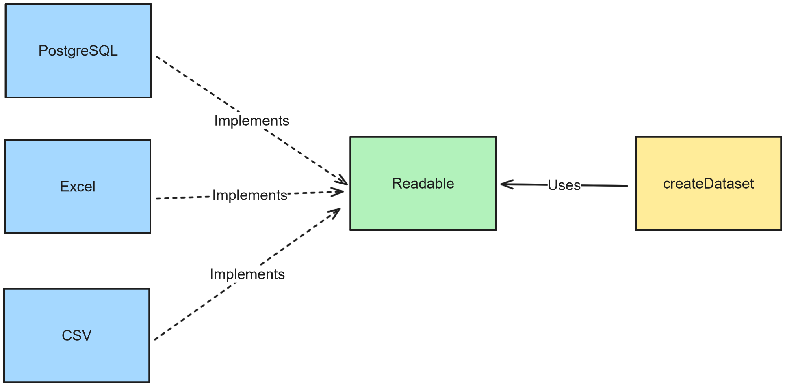

## How to run

The code was tested with Node.js **version 18.16.0**

1. Install the packages with _npm_ command.

```bash
npm install
```

2. Run the code.

```bash
npm start
```

3. Test with command.

```bash
npm test
```

## Output files

The output files are in the **_results_** folder.

## Answers to the Questions

#### 1. Discuss your solution’s time complexity. What tradeoffs did you make?

The complexity is constant - O(n) -, because the code uses the normal loop to iterate sequentially over the dataset. The main tradeoff is the processing speed potential: for a small dataset, like this test, the O(n) complexity is efficient and recommended because the solution is simpler and easier to read.

However, as the dataset grows, the solution loses its efficiency and better solutions such as [binary search](https://blog.logrocket.com/why-binary-search-is-useful/) are recommended. Also, using [Streams](https://fauna.com/blog/how-to-use-node-js-streams) for data processing is recommended as it saves on memory usage, but the code becomes more complex to understand.

#### 2. How would you change your solution to account for future columns that might be requested, such as “Bill Voted On Date” or “Co-Sponsors”?

As I used the functional program paradigm to build the logic, it's only necessary to use some functional method for adding any column. For example, in the `compute_bill_sup_opp`, I can use the `filter` method to return an array of all legislators who are **Co-Sponsors** of the bill, as in the code below. With that, I add a new `CoSponsors` attribute in the returned object that represents all legislators.

```js
const coSponsors = dataset.legislators.filter(
  ({ id }) => id === bill.cosponsor_id
);
return {
  id: bill.id,
  title: bill.title,
  supporter_count: resultMap.get(YEA),
  opposer_count: resultMap.get(NAY),
  primary_sponsor: sponsor?.name ?? DEFAULT_SPONSOR,
  coSponsors,
};
```

#### 3. How would you change your solution if instead of receiving CSVs of data, you were given a list of legislators or bills that you should generate a CSV?

I would change the _file_ `createDataset`'s parameter to use the **_Readable_** interface.

```ts
// Actual coupled using string of files.
declare function createDataset(files: Array<string>): Dataset;
//  Decouple function using interface
declare function createDataset(sources: Readable): Dataset;
```

The **[Readable](https://nodejs.org/api/stream.html#readable-streams)** interface is declared in `stream` module that enables the consumer, `createDataset`, to request data without knowing the source of the data. A lot of library implements this interface:

- If the source is PostgreSQL, we can use the [pg-query-stream](https://www.npmjs.com/package/pg-query-stream);
- Case the source is an Excel file: [node-xlsx](https://www.npmjs.com/package/node-xlsx);
- For the CSV files: [csv-parser](https://www.npmjs.com/package/csv-parser).

All these modules implement the `Readable` interface that enables the consumer to process data without coupling with a specific data format, as shown below.



```ts
// Couple function using files
declare function createDataset(files: Array<string>): Dataset;
//  Decouple function using interface
declare function createDataset(sources: Readable): Dataset;
```

#### 4. How long did you spend working on the assignment?

Around 1 hour and a half, as measured in the commits below

```shell
# Last commit
commit 24fcb8fafedd729a9c6b1c05125a9478aa7e7d7f (HEAD -> master)
Author: lucaspere <lucasrupestre@hotmail.com>
Date:   Wed May 24 09:21:08 2023 -0300
    feat: save the results on disk in csv files

# First commit
commit ee0cb7288c93e7b0bfbdfc53d3e55d27673f092b
Author: lucaspere <lucasrupestre@hotmail.com>
Date:   Wed May 24 07:56:28 2023 -0300
    setup: initial setup
```
